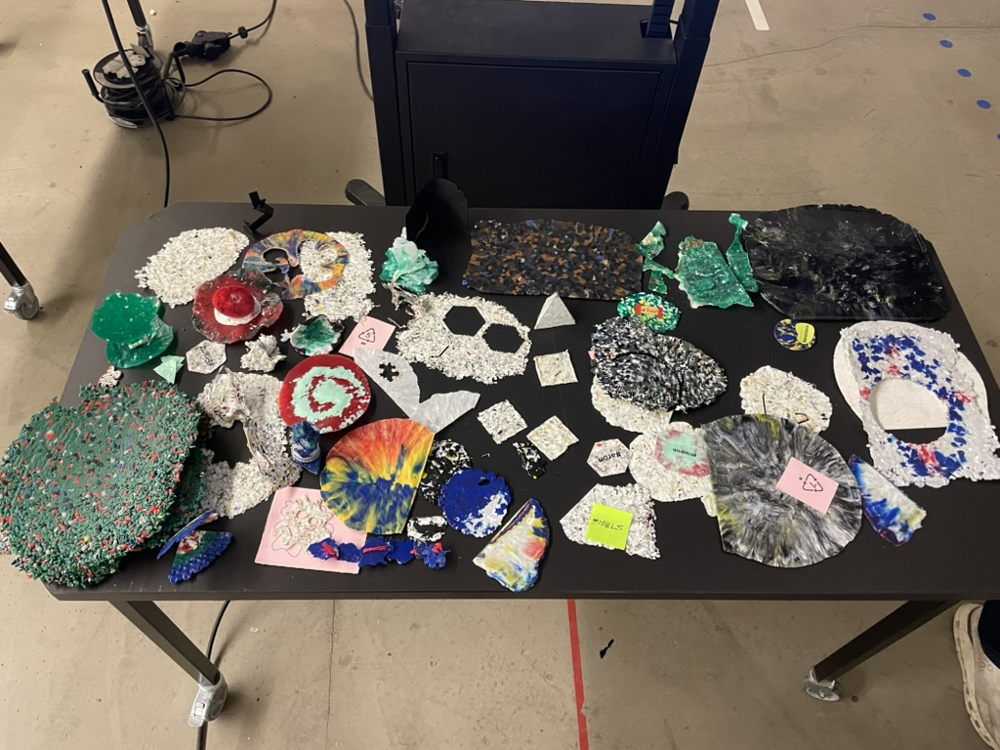
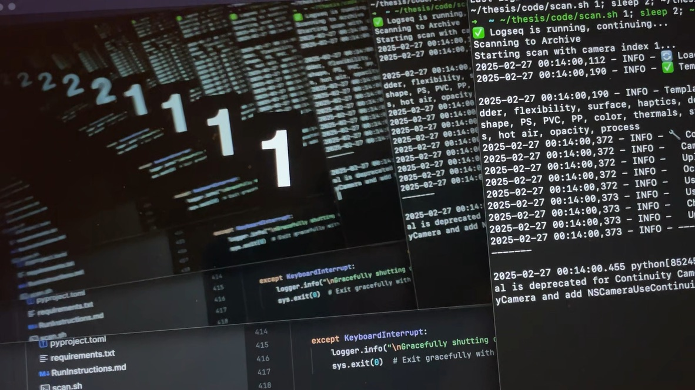
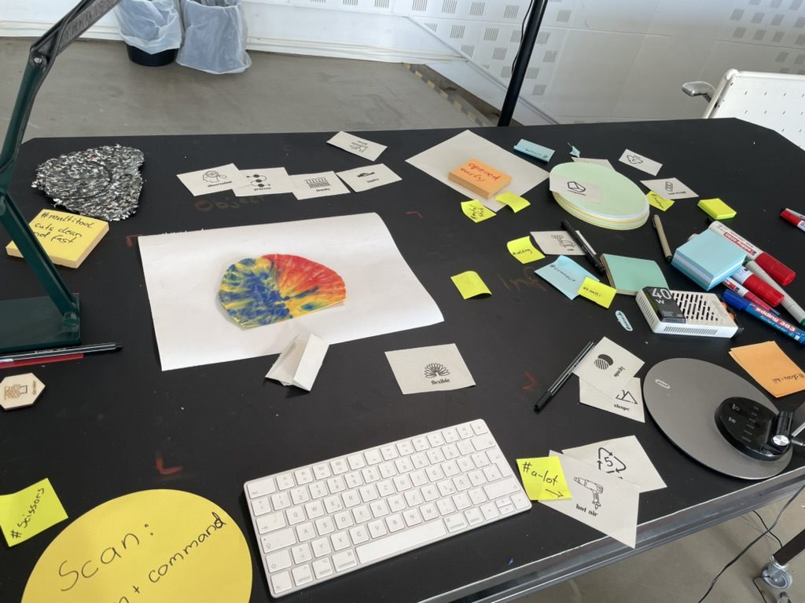
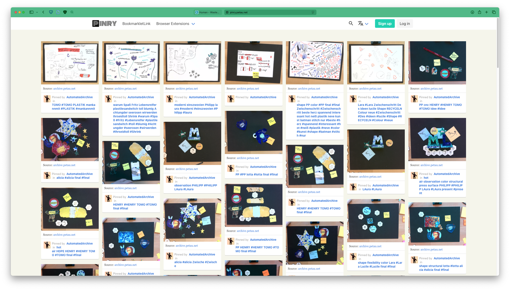

tags:: journal
public:: true
author:: Aron Petau
source:: Computer
date:: 2025-02-27

- 
-
-
- Update: The Mobile Scan option works
	-  
- Pintry is fully Reachable and filled with the Participant results
	- 