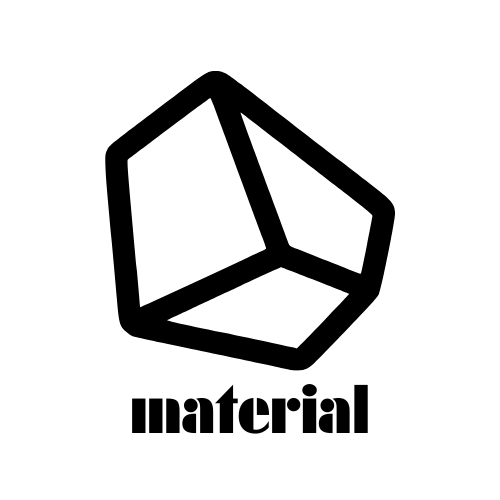
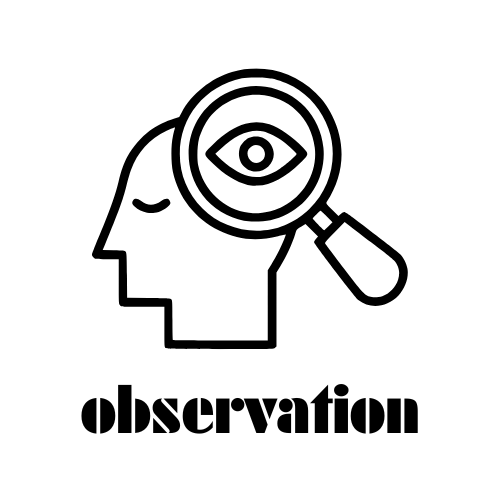
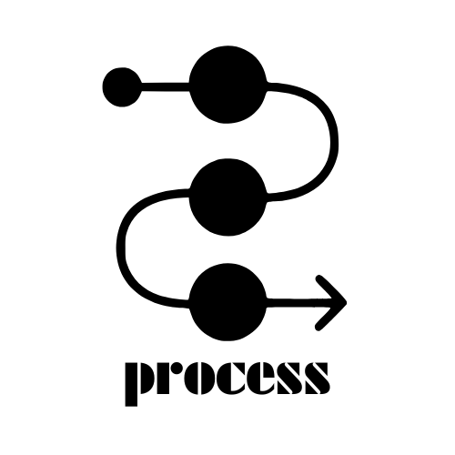
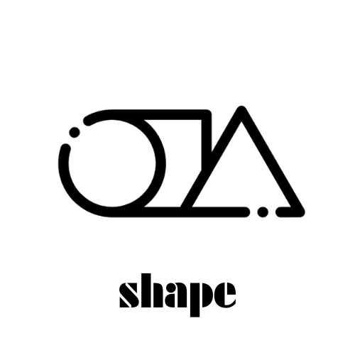
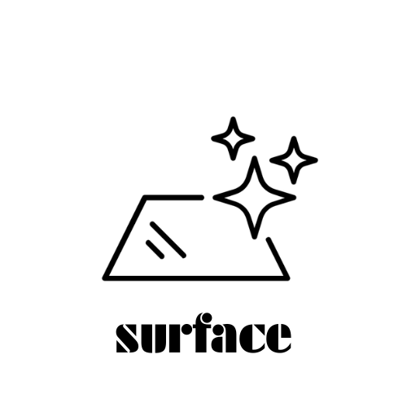

public:: true
tags:: markers

	- ## 1. Material & Composition
	- ### Plastic Types
	- PET
	- HDPE
	- PVC
	- LDPE
	- PP
	- PS
	- O
	- ### Other Materials
	- Composite
	- ## 2. Physical Properties
	- Surface
	- Density
	- Color
	- Shape
	- ## 3. Mechanical & Sensory Properties
	- Haptics
	- Flexibility
	- Joinery
	- ## 4. Processing & Manufacturing
	- Tool
	- Press
	- Hot Air
	- Shredder
	- ## 5. Observation & Analysis
	- Observation
	- Process
	-
	- ### Joinery
		- {height 150, :width 150}
	- ### Aesthetic
		- {height 150, :width 150}
	- ### Material
		- {height 150, :width 150}
	- ### Observation
		- {height 150, :width 150}
	- ### Process
		- {height 150, :width 150}
	- ### Shape
		- {height 150, :width 150}
	- ### Surface
	  id:: 67b48546-7fb6-429b-a162-894c9444737e
		- {height 150, :width 150}
	- ### Tool
		- {height 150, :width 150}
	-