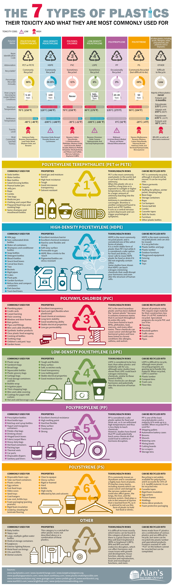

tags:: PET, HDPE, PVC, LDPE, PP, PS, O

- ```mermaid
  graph LR
      subgraph Plastics
          PET["♳\n**Polyethylene Terephthalate (PET or PETE)**"]
          HDPE["♴\n**High-Density Polyethylene (HDPE)**"]
          PVC["♵\n**Polyvinyl Chloride (PVC)**"]
          LDPE["♶\n**Low-Density Polyethylene (LDPE)**"]
          PP["♷\n**Polypropylene (PP)**"]
          PS["♸\n**Polystyrene (PS)**"]
          Other["♹\n**Other Plastics**"]
      end
  
      PET --> PET1([Soft drink bottles])
      PET --> PET2([Water bottles])
      PET --> PET3([Food packaging])
  
      HDPE --> HDPE1([Milk jugs])
      HDPE --> HDPE2([Detergent bottles])
      HDPE --> HDPE3([Toys])
  
      PVC --> PVC1([Pipes])
      PVC --> PVC2([Window frames])
      PVC --> PVC3([Flooring])
  
      LDPE --> LDPE1([Plastic bags])
      LDPE --> LDPE2([Cling film])
      LDPE --> LDPE3([Squeezable bottles])
  
      PP --> PP1([Bottle caps])
      PP --> PP2([Food containers])
      PP --> PP3([Automotive parts])
  
      PS --> PS1([Disposable coffee cups])
      PS --> PS2([Plastic food boxes])
      PS --> PS3([Cutlery])
  
      Other --> Other1([Sunglasses])
      Other --> Other2([DVDs])
      Other --> Other3([Water cooler bottles])
  ```
	- ## Plastics Classes Poster
		- 
		  id:: 67bf05b3-4699-4460-8e91-0416bbfdf014