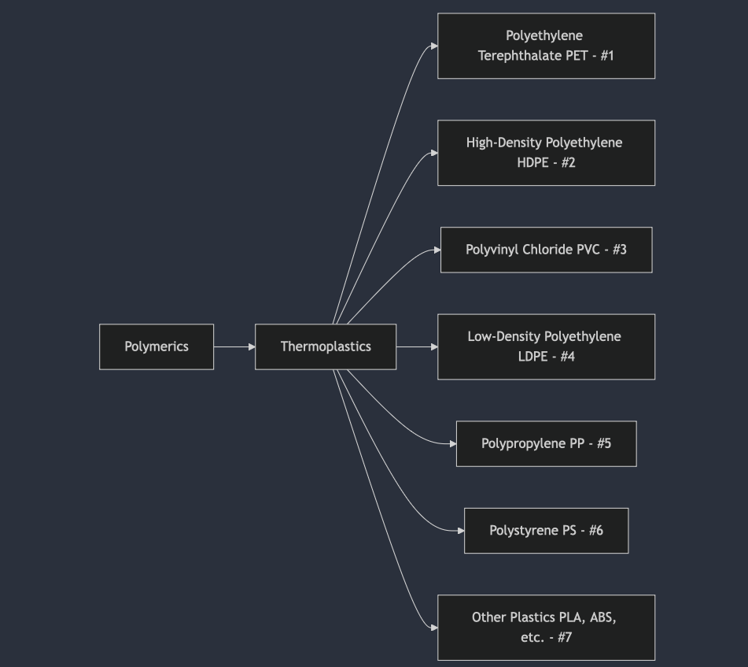

- ```mermaid
  graph TD;
      A[Polymerics] --> B[Thermoplastics]
      
      B --> C[Polyethylene Terephthalate\nPET - #1]
      B --> D[High-Density Polyethylene\nHDPE - #2]
      B --> E[Polyvinyl Chloride\nPVC - #3]
      B --> F[Low-Density Polyethylene\nLDPE - #4]
      B --> G[Polypropylene\nPP - #5]
      B --> H[Polystyrene\nPS - #6]
      B --> I[Other Plastics\nPLA, ABS, etc. - #7]
  ```
- Thermoplastics Subclass
  id:: 67bb6609-06a5-4cce-8154-81993a2ea89b
	- 