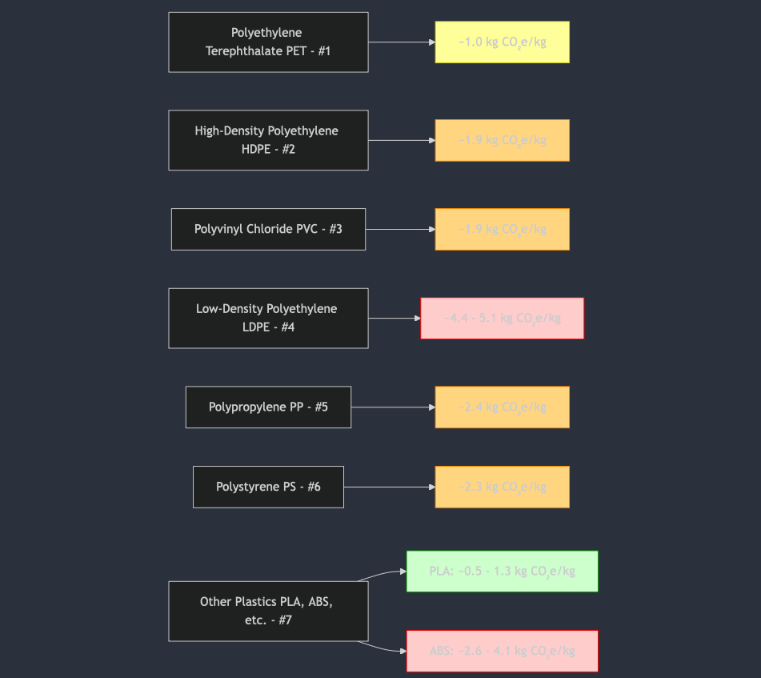

- ```mermaid
  graph TD;
  
      C[Polyethylene Terephthalate\nPET - #1]
      C --> C1["~1.0 kg CO₂e/kg"]:::yellow
  
      D[High-Density Polyethylene\nHDPE - #2]
      D --> D1["~1.9 kg CO₂e/kg"]:::orange
  
      E[Polyvinyl Chloride\nPVC - #3]
      E --> E1["~1.9 kg CO₂e/kg"]:::orange
  
      F[Low-Density Polyethylene\nLDPE - #4]
      F --> F1["~4.4 - 5.1 kg CO₂e/kg"]:::red
  
       G[Polypropylene\nPP - #5]
      G --> G1["~2.4 kg CO₂e/kg"]:::orange
  
       H[Polystyrene\nPS - #6]
      H --> H1["~2.3 kg CO₂e/kg"]:::orange
  
      I[Other Plastics\nPLA, ABS, etc. - #7]
      I --> I1["PLA: ~0.5 - 1.3 kg CO₂e/kg"]:::green
      I --> I2["ABS: ~2.6 - 4.1 kg CO₂e/kg"]:::red
  
      classDef red fill:#FFCCCC,stroke:#FF0000;
      classDef orange fill:#FFD580,stroke:#FF8C00;
      classDef yellow fill:#FFFF99,stroke:#CCCC00;
      classDef green fill:#CCFFCC,stroke:#008000;
  
  ```
-
	- 