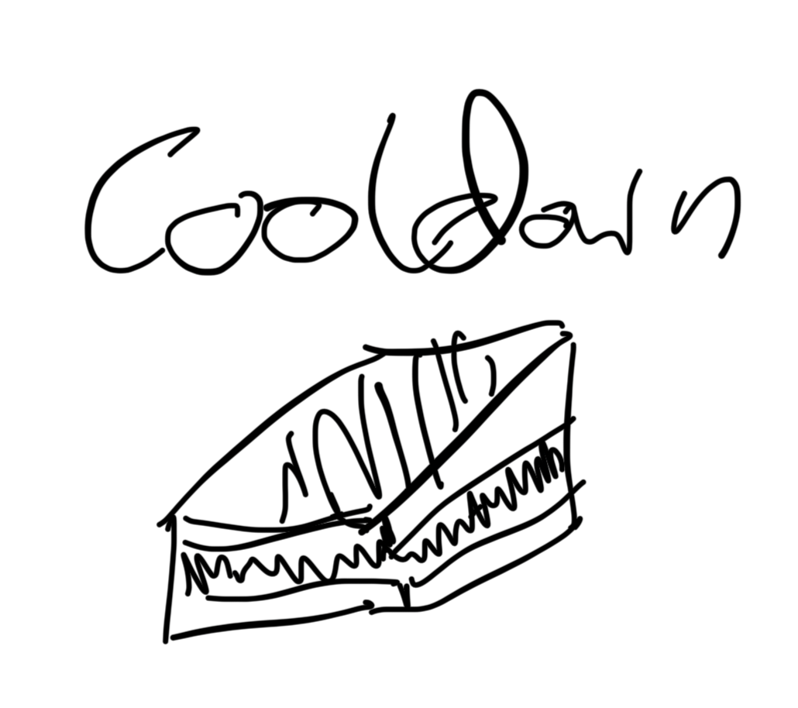
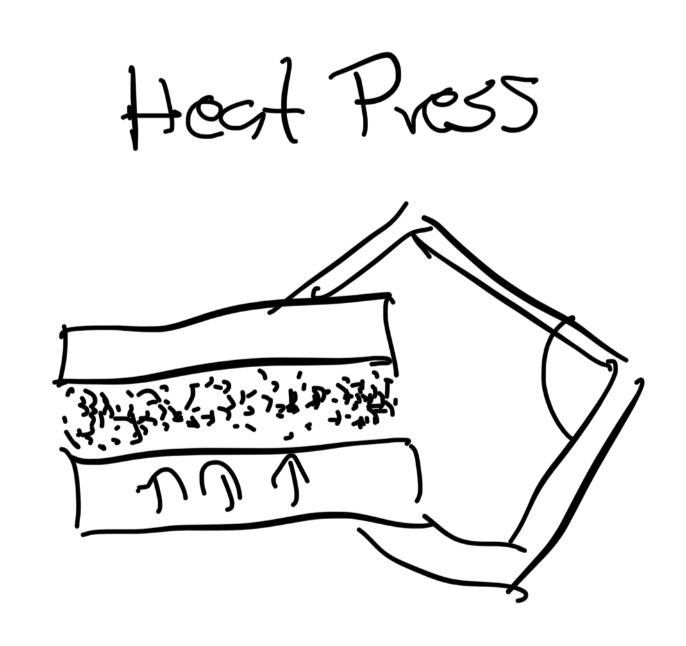
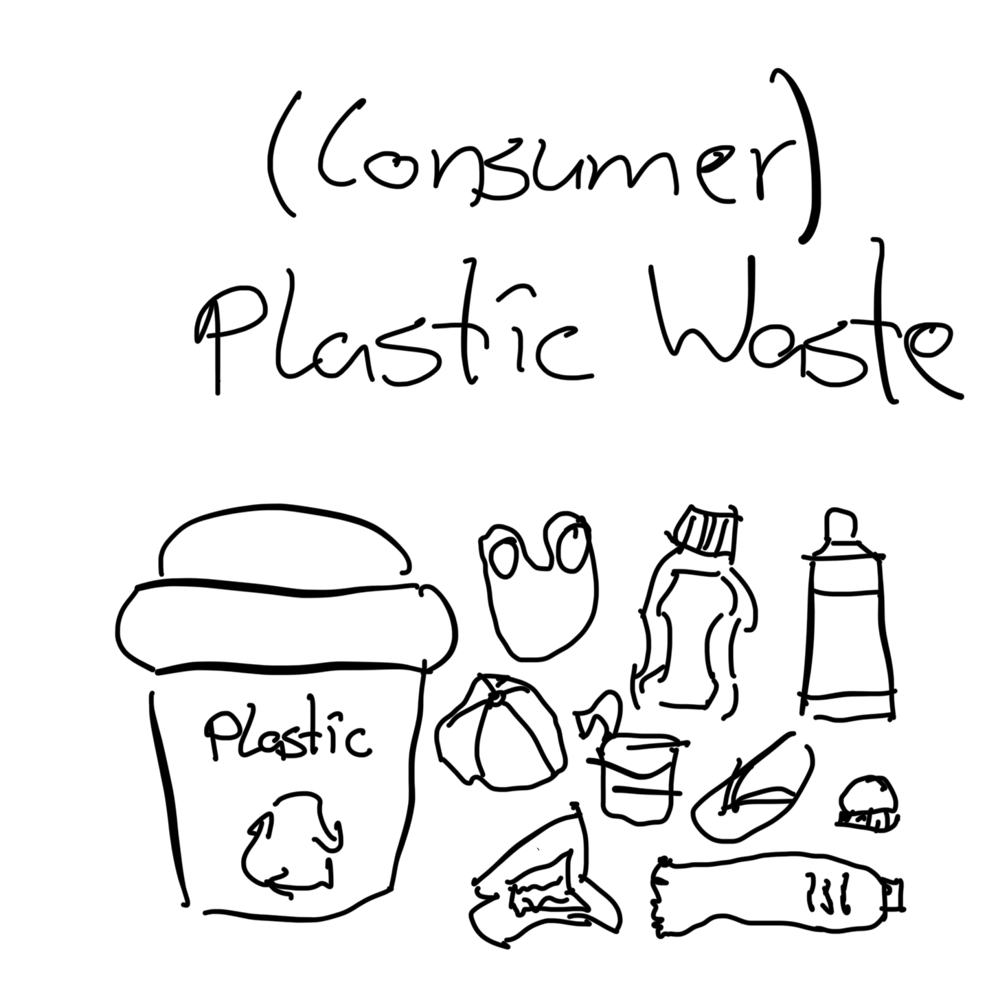
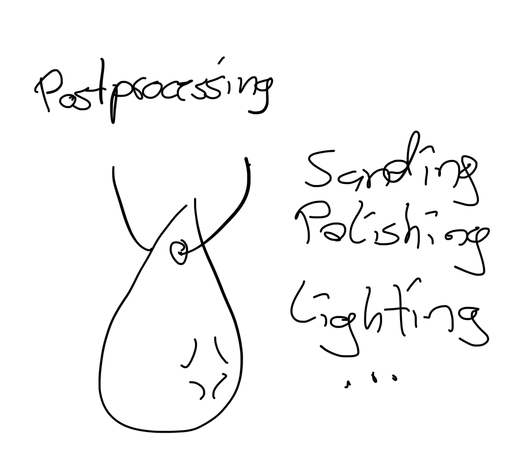
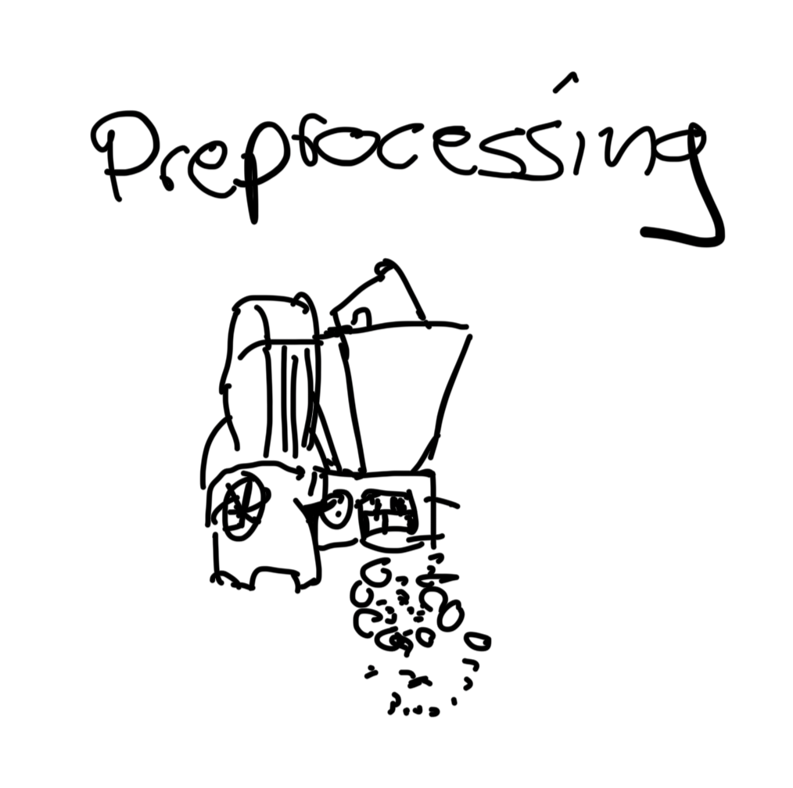
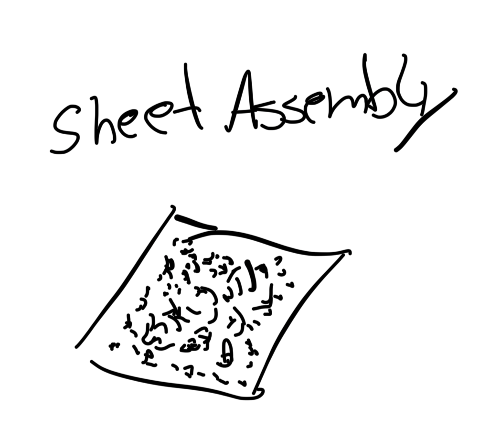
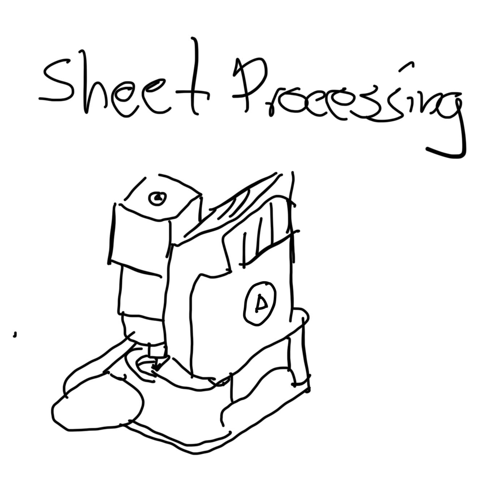

public:: true

- Cooldown
	- {:height 300, :width 330}
	  id:: 67b3a440-d008-4683-af05-9d19c4b38187
- Heat Press
	- {:height 300, :width 330}
	  id:: 67b3a44f-ca51-4f92-b660-5e92f0ab77c5
	-
- Plastic Waste
	- {:height 300, :width 330}
	  id:: 67b3a495-8abe-4144-a257-62551c5dd4a3
- Postprocessing
	- {:height 300, :width 330}
	  id:: 67b3a4a5-96ef-429c-a79d-b0220e798580
- Preprocessing
  id:: 67b3a4b2-28ec-4da4-a6fa-dbfd8c3bd8f9
	- {:height 300, :width 330}
	  id:: 67b3a4be-1ae4-495b-a590-24b7ad194d96
- Sheet Assembly
	- {:height 300, :width 330}
	  id:: 67b3a4cc-338b-44ca-bfaf-c3e48d9dd98d
- Sheet Processing
	- {:height 300, :width 330}
	  id:: 67b3a4dc-1137-43e8-a879-d13b2b689b77